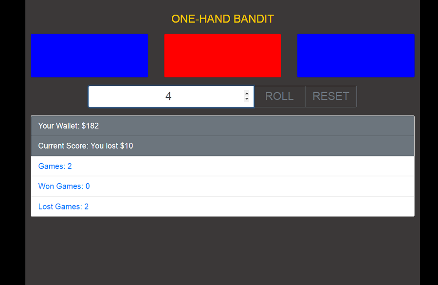

# One-Hand-Bandit Game

This game has been created at javascript. It is a simple one hand bandit game. Just make a bet and roll. If you draw three matching colors or three different one you won, in the other case you lost. To play again just press reset button.

## Tools & Technology used

- Visual Studio Code
- JavaScript
- HTML
- SCSS
- Gulp
